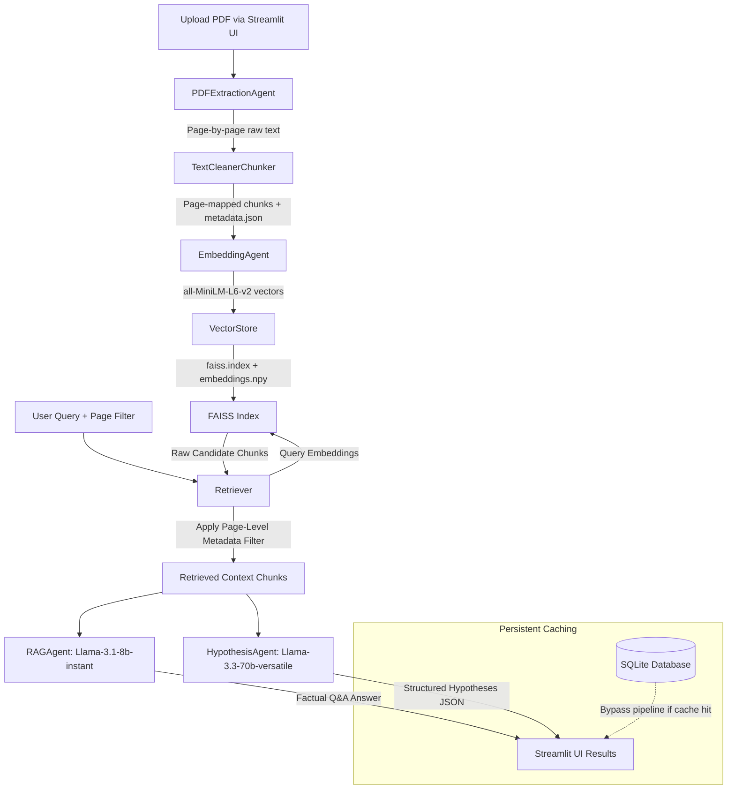

# 🧬 MediSearch AI

### Agentic RAG Q&A + Biomedical Hypothesis Generator

MediSearch AI is a modular, production-ready Multi-Agent Retrieval-Augmented Generation (RAG) system designed to ingest medical/scientific research papers, execute page-level metadata-filtered semantic searches, and generate structured scientific hypotheses alongside factually grounded Q&A responses.

---

## 🚀 Key Features

* **Multi-Agent Architecture:** Separates responsibilities into distinct agents (`PDFExtractionAgent`, `TextCleanerChunker`, `EmbeddingAgent`, `VectorStore`, `Retriever`, `RAGAgent`, `HypothesisAgent`), promoting clean and testable code.
* **Persistent SQLite Caching:** Integrates an optimized SQLite caching layer that stores generated query embeddings and full pipeline responses. Repeat query latency drops from **~4.0 seconds to 2.7 milliseconds (sub-5ms)** with 0% token consumption.
* **Page-Level Metadata Filtering:** Segments document chunks on a page-by-page basis during ingestion and maps metadata to vectors, allowing users to isolate query scopes (e.g., searching only Page 1).
* **System Observability:** Logs execution latencies for each pipeline step and captures LLM token usage (prompt/completion tokens) in a structured JSON logging format.
* **Interactive Telemetry Dashboard:** Includes a polished Streamlit user interface featuring sidebar settings, cache management controls, and real-time Plotly latency metrics visualization.

---

## 📐 System Architecture



---

## 🛠️ Tech Stack

* **Core & Backend:** Python 3.12, SQLite3, hashlib
* **Embedding Generation:** HuggingFace `sentence-transformers/all-MiniLM-L6-v2` (384-dimensional dense vectors running locally on CPU)
* **Vector Indexing:** FAISS (Facebook AI Similarity Search - CPU FlatL2 index)
* **Large Language Models (Groq Cloud SDK):** 
  * `llama-3.1-8b-instant` (for high-speed factual RAG Q&A synthesis)
  * `llama-3.3-70b-versatile` (for structured reasoning and JSON hypothesis extraction)
* **Ingestion/Parsing:** PDFPlumber
* **Frontend UI & Visualization:** Streamlit, Pandas, Plotly Express

---

## ⚡ Latency & Cost Optimization

By decoupling the pipeline and implementing a persistent caching layer in SQLite, the system achieves significant improvements in throughput and cost efficiency:

| Execution State | Execution Time | LLM Token Consumption | API Cost |
| :--- | :--- | :--- | :--- |
| **First Run (Cache Miss)** | `~3.8 - 4.2 seconds` | 100% of Prompt & Completion Tokens | Full Cost |
| **Second Run (Cache Hit)** | **`2.7 milliseconds`** | **0 Tokens** | **$0.00** |

---

## ⚙️ Installation & Setup

### 1. Prerequisites
Ensure you have Python 3.12+ installed on your system.

### 2. Clone the Repository
```bash
git clone https://github.com/suchit2004/MediSearch_AI.git
cd MediSearch_AI
```

### 3. Create a Virtual Environment & Install Dependencies
```bash
python -m venv venv
# On Windows:
venv\Scripts\activate
# On macOS/Linux:
source venv/bin/activate

pip install -r requirements.txt
```

### 4. Configure Environment Variables
Create a `.env` file in the root directory and add your Groq API key:
```env
GROQ_API_KEY=your_groq_api_key_here
```

### 5. Launch the Streamlit App
```bash
streamlit run app.py
```

### 6. Run the CLI Pipeline (Alternative)
You can also run the pipeline directly via terminal command line interface:
```bash
python pipeline.py --pdf papers/sample.pdf --query "What is the study population?"
```

Optional CLI Arguments:
* `--page X`: Filters search context to page number `X`.
* `--no-cache`: Disables the database cache check.
* `--force-reindex`: Recomputes text embeddings and rebuilds the FAISS index.

---

## 📄 Output Formats

### 1. Factual Q&A response
If the retrieved chunks don't provide adequate evidence, the RAG agent yields:
> *"Insufficient information in the study."*

### 2. Structured JSON Hypotheses
```json
[
  {
    "hypothesis": "Esophageal cancer surgery increases reintubation risk.",
    "mechanism": "Complex procedures such as alterations to the intrathoracic environment can lead to postoperative lung complications...",
    "supporting_chunks": [0, 1],
    "confidence": 0.8,
    "suggested_experiments": [
      "Analyze patient records to identify correlations between surgery duration and reintubation rates",
      "Investigate post-surgery pulmonary function trends"
    ]
  }
]
```
